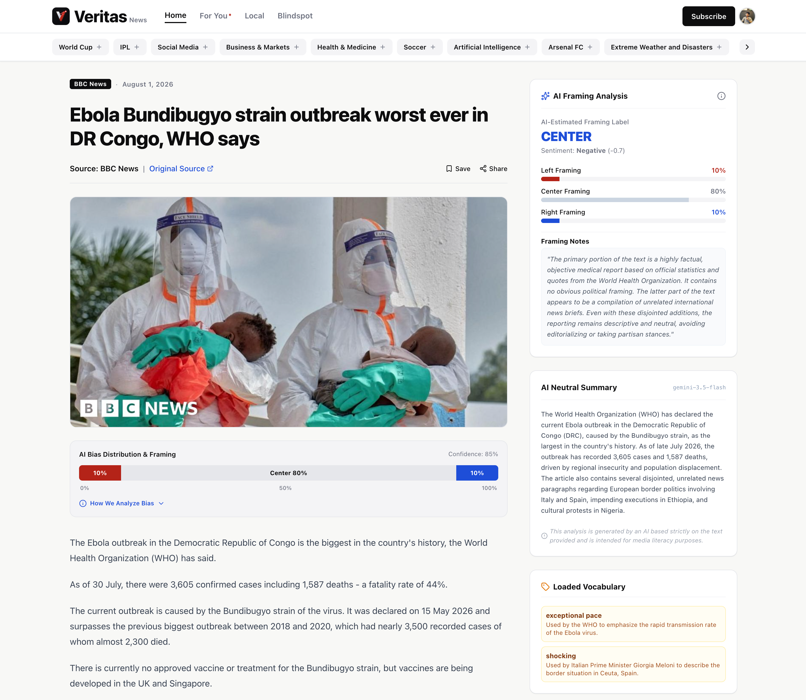

# Veritas News

> **AI-Powered News Analysis, Sentiment Scoring & Political Framing Transparency**

[](https://nextjs.org/)
[](https://www.typescriptlang.org/)
[](https://supabase.com/)
[](https://tailwindcss.com/)
[](https://sdk.vercel.ai/)
[](https://clerk.com/)
[](https://oxylabs.io/)
[](https://posthog.com/)

Veritas News is a production-style web platform that automatically aggregates articles from configured global news sources, processes them with Google Gemini via the Vercel AI SDK, stores structured insights in Supabase, and presents reader-friendly sentiment, political framing, and loaded term analytics.

---

## Interface Showcase

### News Feed & Sentiment Dashboard


### Comprehensive AI Article Analysis


---

## Key Features

- **Multi-Source Web Scraping**: Live manual scraping and automated two-day batch scraping via **Oxylabs Web Scraper API** & **Oxylabs Scheduler**.
- **AI Analysis Engine**: Powered by **Google Gemini** (`@ai-sdk/google`) and **Vercel AI SDK**:
  - Neutral and objective article summaries.
  - Sentiment scoring ($-\!1$ to $+1$) with positive, neutral, or negative labeling.
  - AI-estimated political framing distribution ($\text{Left} + \text{Center} + \text{Right} = 100\%$).
  - Extracted loaded terms and framing notes.
- **pgvector Similarity Search**: Generates 768-dimensional embeddings for articles using Gemini `text-embedding-004` to surface relevant and related stories in real-time.
- **Automated Pipeline**: Vercel Cron integration triggering scheduled Oxylabs processing and AI analysis execution.
- **Secure Authentication & Access**: Managed authentication with **Clerk** and administrative secret protection (`x_veritas_admin_secret`) on action endpoints.
- **Product & Methodology Tracking**: Integration with **PostHog** for product analytics and methodology verification tracking.

---

## Tech Stack

- **Framework**: [Next.js 16](https://nextjs.org/) (App Router, Server Components & Route Handlers)
- **Language & Styling**: [TypeScript](https://www.typescriptlang.org/), [Tailwind CSS v4](https://tailwindcss.com/), and [Lucide React](https://lucide.dev/)
- **Authentication**: [Clerk](https://clerk.com/)
- **Database & Vectors**: [Supabase](https://supabase.com/) (PostgreSQL with `pgvector` extension)
- **AI & ML**: [Vercel AI SDK](https://sdk.vercel.ai/) & [Google Gemini Provider (`@ai-sdk/google`)](https://ai.google.dev/)
- **Scraping & Scheduler**: [Oxylabs Web Scraper API](https://oxylabs.io/) & Cheerio HTML parser
- **Analytics**: [PostHog](https://posthog.com/)

---

## Architecture & Layering

> [!NOTE]
> Veritas News strictly enforces layer separation. UI components render pre-computed database state and never trigger scraping or direct mutation.

```
┌─────────────────────────────────────────────────────────────┐
│                      Next.js Frontend                       │
│        (Home Feed, Article Details, Clerk Auth UI)          │
└──────────────────────────────┬──────────────────────────────┘
                               │ Reads Stored Data
                               ▼
┌─────────────────────────────────────────────────────────────┐
│                   Supabase PostgreSQL DB                    │
│   (sources, articles, article_analyses + pgvector, logs)   │
└──────────────▲──────────────────────────────▲────────────────┘
               │ Writes Articles              │ Writes Analyses
               │                              │
┌──────────────┴──────────────┐┌──────────────┴──────────────┐
│       Scraping Engine       ││      AI Analysis Engine      │
│  (Oxylabs API / Scheduler   ││ (Vercel AI SDK + Gemini 2.5  │
│   + Cheerio Link Extractor) ││  + text-embedding-004)      │
└─────────────────────────────┘└─────────────────────────────┘
```

---

## Getting Started

### Prerequisites

- Node.js 20+
- npm, yarn, or pnpm
- Supabase account and project (with `pgvector` enabled)
- Clerk application keys
- Oxylabs Web Scraper API credentials
- Google Gemini API key

### 1. Clone & Install

```bash
git clone https://github.com/fatin-israq/veritas-news.git
cd veritas-news
npm install
```

### 2. Environment Configuration

Create a `.env.local` file in the root directory modeled after `.env.example`:

```bash
# Clerk Auth
NEXT_PUBLIC_CLERK_PUBLISHABLE_KEY=pk_test_...
CLERK_SECRET_KEY=sk_test_...
NEXT_PUBLIC_CLERK_SIGN_IN_URL=/sign-in
NEXT_PUBLIC_CLERK_SIGN_UP_URL=/sign-up

# Supabase
NEXT_PUBLIC_SUPABASE_URL=https://your-project.supabase.co
NEXT_PUBLIC_SUPABASE_ANON_KEY=your-anon-key
SUPABASE_SERVICE_ROLE_KEY=your-service-role-key

# Oxylabs Scraping
OXY_WSA_USERNAME=your_oxylabs_username
OXY_WSA_PASSWORD=your_oxylabs_password

# Veritas Admin Secret
x_veritas_admin_secret=your_admin_secret
VERITAS_ADMIN_SECRET=your_admin_secret

# AI SDK (Google Gemini)
GEMINI_API_KEY=your_gemini_api_key
GOOGLE_GENERATIVE_AI_API_KEY=your_gemini_api_key

# PostHog Analytics
NEXT_PUBLIC_POSTHOG_KEY=phc_...
NEXT_PUBLIC_POSTHOG_HOST=https://us.posthog.com
```

### 3. Database Schema Setup

Run the SQL migration script located at `supabase/schema.sql` inside the **Supabase Dashboard → SQL Editor**. This provisions core tables, RLS policies, vector extensions, and the `match_articles` similarity function.

### 4. Run Development Server

```bash
npm run dev
```

Open [http://localhost:3000](http://localhost:3000) to access Veritas News.

---

## API Endpoints

> [!IMPORTANT]
> All mutation endpoints (`POST`) require the `x_veritas_admin_secret` header matching your configured environment variable.

| Endpoint | Method | Security | Description |
| :--- | :---: | :---: | :--- |
| `/api/sources` | `GET` | Public | List active news sources configured in Supabase. |
| `/api/scrape` | `POST` | `x_veritas_admin_secret` | Trigger manual web scraping for active sources. |
| `/api/analyze` | `POST` | `x_veritas_admin_secret` | Run AI sentiment and framing analysis on pending articles. |
| `/api/oxylabs/schedules` | `GET` / `POST` | `x_veritas_admin_secret` | Manage automated Oxylabs scraping schedules. |
| `/api/oxylabs/scheduled-results/process` | `POST` | `x_veritas_admin_secret` | Process completed Oxylabs schedule runs into valid articles. |
| `/api/cron/pipeline` | `GET` | `CRON_SECRET` | Internal Vercel Cron endpoint chaining scrape processing & AI analysis. |
| `/api/logs` | `GET` | Public | View system execution logs and scraping/analysis audit trails. |

---

## Automated Cron Pipeline

The automated scraping and analysis pipeline runs every 2 days via **Vercel Cron** (`vercel.json`):

1. **Oxylabs Scheduler** scrapes configured news source homepages every 48 hours.
2. **Vercel Cron** triggers `GET /api/cron/pipeline` 15 minutes post-scrape.
3. The cron handler fetches completed Oxylabs HTML, parses article detail links, dedupes, saves valid articles, and triggers AI analysis immediately.

> [!TIP]
> In local development, the `CRON_SECRET` check is bypassed so you can test `/api/cron/pipeline` directly via browser or cURL.

---

## Framing and AI Methodology Note

> [!NOTE]
> Political framing indicators (Left / Center / Right) are **AI-estimated** approximations derived solely from structural linguistic markers, framing notes, and extracted loaded terms within article text. They are presented for media literacy transparency rather than objective truth.
